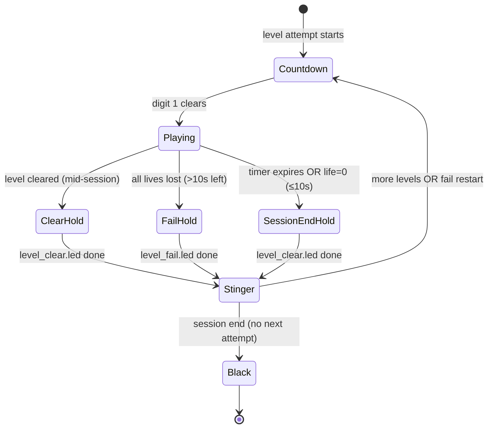

# LED Grid — effects implementation plan

Implementation plan for audio, countdown, level transitions, and LED floor
effects per [EFFECTS_SPEC.md](./EFFECTS_SPEC.md),
[GLOBAL_RULES.md](../../docs/game-effects/GLOBAL_RULES.md), and
[LOCKED_DECISIONS.md](../../docs/game-effects/LOCKED_DECISIONS.md).

**Status:** Aligned with locked product decisions — **ready for implementation**.  
**Target repo:** `led-grid/`  
**Primary integration point:** `api/game_manager.py` session loop + marathon wiring.

**Testing / TDD (locked #13, mandatory):** [docs/game-effects/TESTING_CONTRACT.md](../../docs/game-effects/TESTING_CONTRACT.md) — red→green→refactor via API; prove `phase` / `accepting_input` inside the marathon loop; Layer B smoke with FE + sim. No merge without green `tests/test_effects_session_loop.py`.

---

## Plan review (2026-08-07)

**Verdict:** **Ready** for parallel implementation after the revisions below (no blocking spec/code conflicts remain).

| Gate | Status |
|------|--------|
| Aligns with GLOBAL_RULES + EFFECTS_SPEC + diagram | **Pass** |
| Code audit vs `api/game_manager.py` (~L1840–1964) | **Pass** (gaps documented) |
| `.led` via same load/play path + native 16×26 | **Pass** |
| Session-end paths (timeout, life≤10s, sequence done) | **Fail → fixed** in §2.5 (`_finish_session()`) |
| Countdown single insertion point | **Fail → fixed** in §2.5 (top of restart loop only) |
| Non-blocking audio / BGM stop semantics | **Fail → fixed** in §3.2 |
| Frontend double-countdown on level 1 | **Locked** — both UI + floor countdown run (~sync) |

### Top findings

| # | Severity | Finding | Plan change |
|---|----------|---------|-------------|
| 1 | **Blocker (fixed)** | Marathon loop ends with immediate `_hw_blank_floor()` (~L1963) — no blue hold on **timer expire**, **life≤10s**, or **pre-loop timeout break** (~L1860–1863). | Added `_finish_session()`; all terminal paths call it before black. |
| 2 | **Blocker (fixed)** | Pseudocode ran `countdown.led` in both the restart-loop top **and** the clear/fail branches — risk of double countdown. | **Single** countdown at top of inner `while True`; clear/fail run hold + stinger only. |
| 3 | **Blocker (fixed)** | Fail-restart path refills HP (`refill_life_for_restart`, ~L1920–1924) **before** any effect phase would run. | Order locked: `level_fail.led` → stinger → `continue` → countdown (loop top) → refill HP → replay. |
| 4 | **High (fixed)** | Plan suggested `level_fail.led` for life=0 with ≤10s session time left. GLOBAL_RULES session/game over uses **level_clear** hold (same as timer expire), not red fail. | `_finish_session()` always plays `level_clear.led`; red fail only on >10s restart path. |
| 5 | **High (fixed)** | `stop_bgm()` must not call broad mixer stop that cuts stinger SFX channels (Hoops/Climb lesson). | §3.2: `mixer.music.stop()` only for BGM; stingers on dedicated `Sound` channels. |
| 6 | **High (fixed)** | Hold timing: separate `await_hold(2.5)` **plus** `.led` `end_time_sec` risks double hold / drift. | `.led` timeline is the single hold authority; stinger fires once at phase entry (concurrent, non-blocking). |
| 7 | **Medium (fixed)** | `EFFECTS_SPEC.md` L81–96 — level-fail copy sat under **Timer expire**; stray red line at L89. | Fixed in spec (2026-08-07 gap pass); see §Gap analysis. |
| 8 | **Medium (locked)** | Pre-session `CountdownScreen` (3-2-1-**GO**, 1 s/step) must stay in sync with backend floor countdown. | Both UI and floor countdown run; backend `.led` authoritative for floor; UI mirrors `phase` + `countdown_digit`. |
| 9 | **Low (verified)** | `_run_level_attempt()` + `begin_level_transition` / `finish_level_transition` (~L554–599, L1123–1191), `prepare_level_for_platform()` (~L239+ in `level_scaler.py`), 16×26 defaults, diagram green 3-2-1 (no floor GO) — all match repo. | No change. |

### Locked decisions applied

All product decisions are locked in [LOCKED_DECISIONS.md](../../docs/game-effects/LOCKED_DECISIONS.md). Grid-specific notes:

| # | Locked decision | Grid application |
|---|-----------------|------------------|
| 1 | Effects directory | `games/source/effects/` |
| 2 | Effect files (exactly three) | `countdown.led`, `level_clear.led`, `level_fail.led` |
| 4 | UI + floor countdown | Both run; keep approximately in sync (floor from backend `.led`; UI countdown stays) |
| 5 | Transition stinger | One shared `games/audio/transition_stinger.mp3` for clear **and** fail |
| 6 | Audio helper | `api/audio_manager.py` with class `AudioManager` — non-blocking |
| 7 | Phase fields | `/game-state` exposes `phase` + `accepting_input` (no RFID changes) |
| 8–9 | Session end paths | Life=0 with ≤10 s left **or** last level cleared → `level_clear.led` → stinger → black; no countdown |
| 10 | Score SFX | Backend authoritative; mute frontend synth when backend audio active |
| 12 | `.led` authoring | Study existing levels; bootstrap effect `.led`; test in sim |

Additional Grid locks (from spec review):

| # | Decision |
|---|----------|
| G1 | **Effect visuals = standalone `.led` mini-levels**, loaded via `_load_level_file()` → `_prepare_level_attempt()` → `Play.running()` (not hard-coded RGB fills). |
| G2 | **Native 16×26 effect authoring** — archives authored at full matrix size; `prepare_level_for_platform()` still called for one code path / future retargets. |
| G3 | Floor countdown shows green **3-2-1 only** (no GO glyph on floor; UI may show GO when `phase=playing`). |

---

## Gap analysis (2026-08-07)

**Verdict:** **Ready for implementation** — plan aligns with [LOCKED_DECISIONS.md](../../docs/game-effects/LOCKED_DECISIONS.md), [EFFECTS_SPEC.md](./EFFECTS_SPEC.md), and [GLOBAL_RULES.md](../../docs/game-effects/GLOBAL_RULES.md). No blocking doc conflicts remain. Runtime effects are **not yet wired** in `game_manager.py` (expected).

### Severity summary

| Severity | Open | Fixed this pass |
|----------|------|-----------------|
| **Blocker** | 0 | 0 (prior plan review resolved 3) |
| **High** | 0 | 0 (prior plan review resolved 3) |
| **Medium** | 2 | 1 |
| **Low** | 3 | 1 |
| **Total** | **5** | **2** |

### Findings

| # | Severity | Area | Finding | Resolution |
|---|----------|------|---------|------------|
| G1 | **Medium (fixed)** | `EFFECTS_SPEC.md` | Timer-expire section incorrectly included red fail bullets (L89–95); no `## Level fail` heading; session-end paths (life≤10s, last level) implicit only. | Spec restructured: separate **Level fail**, **Session end**, and **Effect files** sections with locked filenames. |
| G2 | **Medium (open)** | Runtime | `game_manager.py` session loop (~L1840–1964): no effect phases, no `_finish_session()`, bare `_hw_blank_floor()` on exit (~L1963), HP refill before any fail hold (~L1920–1924). | Documented in §1.1; addressed by Phase B tasks (B4–B8). |
| G3 | **Medium (open)** | Assets | `games/source/effects/` missing; no `countdown.led` / `level_clear.led` / `level_fail.led` archives; no `api/audio_manager.py`. | Phase A + B tasks. |
| G4 | **Low (fixed)** | Filenames | Cross-game review still lists Grid as `clear.led` / `fail.led` aliases ([PLAN_REVIEW_CROSS_GAME.md](../../docs/game-effects/PLAN_REVIEW_CROSS_GAME.md) L157). Grid plan + spec now lock `level_clear.led` / `level_fail.led` only. | Grid docs consistent; cross-game doc update is a separate housekeeping item. |
| G5 | **Low (open)** | Frontend | `CountdownScreen.jsx`: pre-start only, 1 s/step + UI **GO**; no `phase` / `countdown_digit` subscription. | Phase C (C1–C2); floor remains 3-2-1 only per G3. |
| G6 | **Low (open)** | State API | `current_state` has no `phase`, `accepting_input`, or `countdown_digit`. | Phase B task B9. |
| G7 | **Low (open)** | Audio | `pygame` mocked in `game_manager.py` (~L74–75); score SFX frontend-only. | Phase B tasks B2, B5. |

### Locked-decision verification

| Decision | Plan | Spec | Code (spot-check) |
|----------|------|------|-------------------|
| Effect files: `countdown.led`, `level_clear.led`, `level_fail.led` | ✓ §2.2 | ✓ Effect files table | ✗ not present |
| Floor countdown 3-2-1, **no GO** on floor | ✓ G3 | ✓ Countdown note | ✗ no backend countdown |
| UI + floor both run (~sync) | ✓ locked #4 | ✓ L62–63 | △ UI only pre-start |
| Session end → `level_clear.led` → stinger → black, no countdown | ✓ §2.5 | ✓ Session end | ✗ immediate blank |
| Fail restart (>10s) → `level_fail.led` → stinger → countdown | ✓ §2.5 | ✓ Level fail | ✗ immediate refill+replay |
| Shared `transition_stinger.mp3` | ✓ §3.4 | ✓ Effect files | ✗ not present |
| `phase` + `accepting_input` on `/game-state` | ✓ §2.7 | — | ✗ not exposed |

### Code audit notes (`game_manager.py`)

Confirmed against live repo (2026-08-07):

- `_run_level_attempt()` + `begin_level_transition()` / `finish_level_transition()` exist (~L554–599) — reuse for effect runner.
- Life=0 branch: >10s sets `_restart_level` (~L1658–1661); ≤10s sets `_session_over` (~L1663–1665) — matches locked session-end vs fail-restart split.
- Timer expire sets `_session_over` (~L1666–1668) — `_finish_session()` must play blue clear, not fail.
- Last level cleared: `_level_cleared` → inner `break` → `for` loop exhausts → session publish + `_hw_blank_floor()` (~L1935–1963) — plan's `_finish_session()` blank-only path applies after inner-loop clear hold.
- No references to `clear.led` or `fail.led` anywhere in `led-grid/`.

### Remaining human opens

1. **Transition stinger asset** — stock OK for MVP; final clip TBD (`games/audio/transition_stinger.mp3`).
2. **Countdown digit glyph design** — author 8×8 green glyphs centered on 16×26; reference MP4 in `~/Downloads/Floor is lava/`.
3. **UI timing sync** — pre-start `CountdownScreen` (1 s/step + GO) vs backend floor (0.8 s/step, no GO): accept ~sync drift or retune UI to 0.8 s when Phase C lands?
4. **Hold duration tuning** — 2.5 s default in plan; operator env/settings override (task C3).
5. **Cross-game doc housekeeping** — update `PLAN_REVIEW_CROSS_GAME.md` Grid filename row from `clear.led` to `level_clear.led` (non-blocking).

---

## 1. Audit — current state vs spec

### 1.1 What exists today

| Area | Current behavior | Spec requirement | Gap |
|------|------------------|------------------|-----|
| **Session loop** | Marathon via `_build_level_sequence()` → `_run_level_attempt()` → `Play.running()` (~L1856–1933) | Same core path, plus effect phases between attempts | No effect phases |
| **Level load** | `_load_level_file()` picks first `play_order=False` board; `prepare_level_for_platform()` scales to 16×26 | Effect `.led` mini-levels use same load + play pipeline | No `games/source/effects/` tree; no effect runner |
| **Countdown** | Frontend `CountdownScreen` runs **once** before `/start-game` (3-2-1-**GO**, 1 s/step, Web Audio beeps) | Floor countdown before **every** level; green 3-2-1 only on floor; tick SFX; ~0.8 s/digit | Backend never runs countdown; frontend timing/colors diverge; GO on floor forbidden |
| **Level clear** | `_level_cleared` flag → next level immediately | All blue ~2–3 s → stinger → countdown → next level | No blue hold, stinger, or inter-level countdown |
| **Level fail** | `life<=0` with >10 s session left sets `_restart_level`, refills HP, replays with no pause (~L1656–1662, L1920–1924) | All red ~2–3 s → stinger → countdown → same level | No fail screen, stinger, or countdown; refill runs too early |
| **Timer expire** | Frame callback sets `_session_over`, `result=2` (~L1666–1668); loop ends; `_hw_blank_floor()` (~L1963) | Blue clear hold → stinger → black; **no countdown** | Skips blue hold + stinger |
| **BGM** | `pygame` mocked in `game_manager.py` imports (~L74–75); no mixer calls | BGM only during active gameplay | Not wired |
| **Score SFX** | Frontend synth beeps on score/life change | Shared positive/negative MP3 (cross-game) | Backend + floor path silent; frontend uses placeholders |
| **Input gating** | `accepting_input` toggled via `begin_level_transition()` / `finish_level_transition()` | Input off during all effect/transition phases | Reuse `transition_consumer` in effect runner |
| **LED output** | Gameplay frames via priority classifier + `_hw_draw_floor()` | Effect frames must use same HW/sim publish path | Infrastructure reusable; effect frames never emitted |
| **State API** | `current_state` exposes score, life, `led_display`, `game_over`, etc. | UI/floor sync needs explicit phase | No `phase` / countdown digit fields |
| **Tests** | Strong coverage for scaling, catalog, gameplay scoring | None for effects/session transitions | New test module required |

### 1.2 Reference assets

Capture timing reference: `~/Downloads/Floor is lava/`

| File | Use |
|------|-----|
| `game_start_countdown_visual.mp4` | Digit layout + ~0.8 s pacing |
| `level_clear_and_game_end_visual.mp4` | Blue full-floor hold |
| `all_lives_lost_level_failed_visual.mp4` | Red full-floor hold |
| `NSynk_-_bye-bye-bye_(mp3.pm).mp3.mpeg` | BGM |
| `positive_score_sound.mp3.mpeg` | Score gain SFX |
| `negative_score_sound.mp3.mpeg` | Penalty SFX |

Ship copies into `games/audio/effects/` with stable filenames; do not read from `~/Downloads/` at runtime.

### 1.3 Spec doc note

`docs/EFFECTS_SPEC.md` § “Timer expire” (L81–96) is immediately followed by red fail bullets without a `## Level fail` heading; L89 incorrectly says red under timer expire. Implementation follows GLOBAL_RULES + diagram: **blue** on timer expire and session/game over; **red** on all-lives-lost restart path (>10 s remaining).

---

## 2. Architecture

### 2.1 High-level session state machine



**Mid-session clear:** `ClearHold → Stinger →` (next `lvl_path`) `Countdown → Playing`.  
**Fail restart:** `FailHold → Stinger → Countdown → Playing` (same level, HP refilled after countdown).  
**Session end** (timer, life≤10s, sequence exhausted, stop): `level_clear.led → Stinger → Black` — **no countdown**.

**Locked session flow** (from [LOCKED_DECISIONS.md](../../docs/game-effects/LOCKED_DECISIONS.md)):

```
Every level start:
  play(countdown.led) + UI countdown (~sync) → play(gameplay) + BGM

Lives = 0 and >10 s left:
  stop BGM → play(level_fail.led) + stinger → play(countdown.led) → restart same level

Lives = 0 and ≤10 s left:
  stop BGM → play(level_clear.led) + stinger → black → session end

Level cleared (more levels remain):
  stop BGM → play(level_clear.led) + stinger → play(countdown.led) → next level

Timer expire OR last level cleared:
  stop BGM → play(level_clear.led) + stinger → black → session end
```

### 2.2 Effect `.led` inventory

Create `games/source/effects/` (exclude from `_TIERS_*` marathon globs):

| File | Purpose | Authored size | `board_time` target |
|------|---------|---------------|---------------------|
| `countdown.led` | Green centered 3, 2, 1 sequence | **16×26** | ~2.4 s (3×0.8 s) + trailing black |
| `level_clear.led` | Solid blue all cells | **16×26** | 2.5 s (tunable 2–3 s) |
| `level_fail.led` | Solid red all cells | **16×26** | 2.5 s |

Each archive contains **one** main board (`play_order=False`). Use `floor_light` groups only (no wall/screen). Colors:

- Countdown digits: green `(0, 254, 0)`.
- Clear: blue `(0, 0, 254)`.
- Fail: red `(254, 0, 0)`.

Author with `zone_row_from=0, zone_row_to=16, zone_col_from=0, zone_col_to=26`, `scale=none`, full-matrix `activity_area`.

### 2.3 Platform scaling decision

**Decision: author effect `.led` files at native 16×26; do not rely on upscaling from legacy sizes.**

**Runtime rule:** still call `prepare_level_for_platform()` for effects (same as gameplay) so one code path handles future venue retargets. At 16×26 target, prepared geometry must be **bit-identical** to authored (assert in tests).

Solid fill patterns (`level_clear` / `level_fail`) *could* be generated in code, but locked decision G1 forbids that for shipping behavior.

### 2.4 Effect playback module

Add `api/effects_runner.py` (name flexible). Prefer wrapping **`_run_level_attempt()`** so `begin_level_transition()` / `finish_level_transition()` gating stays consistent:

```python
def run_effect_led(
    path: Path,
    *,
    game,
    led_table,
    settings,
    play: Play,
    publish_frame,      # callable(led_display) → HW + game.update_state
    stop_flag,          # lambda: not game.running
) -> None:
    """Load one effect .led, run Play.running() with a no-score callback."""
```

**Effect frame callback (contrasts with gameplay `_frame_callback`):**

- No scoring, life checks, or level-progress logic.
- `accepting_input = False` for entire effect.
- Stop when `total_pass >= board_time_sec` (from loaded groups) **or** `stop_flag` **or** `game._session_over`.
- Publish flat `led_display` from active `floor_light` groups (effects have no overlaps — direct group colors OK).
- Derive `countdown_digit` (`3`/`2`/`1`/`null`) from which green digit group is active at `total_pass`.
- Wall-clock session timer keeps running; effect time counts against the 5-min marathon (existing `session_elapsed` semantics).

Wire from `GameManager.start_game()` → `_run_game()` — **outside** the gameplay `_frame_callback`.

### 2.5 Session loop insertion points

Modify the session loop in `game_manager.py` (~L1840–1964). Add helpers:

```python
def _finish_session(game, audio):
    """Session end: level_clear hold → stinger → black. No countdown."""
    if game.running:
        run_effect_led(level_clear.led, phase="level_clear", ...)
        audio.play_stinger()          # fire-and-forget; concurrent with clear hold
    game.update_state(phase="session_end")
    _hw_blank_floor(game.led_table)
```

**Corrected marathon pseudocode:**

```
for lvl_path in level_sequence:
    if game._session_over or not game.running: break
    if session_elapsed > game.game_time_sec:
        game._session_over = True; game._end_reason = "timeout"; break

    while True:                                    # restart loop (same lvl_path)
        run_effect_led(countdown.led, ...)         # EVERY attempt — single insertion point
        audio.play_countdown_ticks()               # per digit, non-blocking
        if game._restart_level:                    # set by prior fail exit; consume before play
            game.refill_life_for_restart()
            game._restart_level = False
        audio.start_bgm()
        _run_level_attempt(gameplay lvl_path, ...) # existing path
        audio.stop_bgm()                           # mixer.music only

        if game._session_over: break

        if game._restart_level:                    # life=0, >10s session time left
            run_effect_led(level_fail.led, ...)
            audio.play_stinger()
            continue                                 # → countdown at loop top, then refill

        if game._level_cleared:
            game.levels_cleared += 1
            run_effect_led(level_clear.led, ...)
            audio.play_stinger()
            break                                    # next lvl_path → its own countdown

        break

    if game._session_over: break

# ALL terminal exits (timeout break, life≤10s, sequence done, stop_game):
_finish_session(game, audio)                       # replaces bare _hw_blank_floor at ~L1963
# then existing result / game_over state publish
```

**Path notes:**

| Exit | Effect sequence before black |
|------|------------------------------|
| Timer expire mid-level | `_finish_session()` → `level_clear` + stinger (no countdown) |
| Life=0 with ≤10 s left | `_finish_session()` → `level_clear` + stinger (not `level_fail`) |
| Pre-loop timeout (~L1860) | `_finish_session()` before result publish |
| Last level cleared | `level_clear` + stinger already ran in inner loop → `_finish_session()` only blanks (no second clear, no countdown) |
| Fail restart (>10 s) | `level_fail` + stinger → countdown → refill → replay; no `_finish_session()` |

**First level:** backend countdown at loop entry runs in parallel with UI countdown (~sync). Both are authoritative for their surfaces (see locked decision #4).

### 2.6 LED / HW publish path

Reuse existing pipeline:

1. Effect callback builds `led_display` row-major flat list (same as gameplay).
2. `game.update_state(led_display=..., phase=..., accepting_input=..., countdown_digit=...)`.
3. `_hw_draw_floor()` when `USE_SERIAL_HD=1`.
4. `ws_bridge` already maps flat display → simulator grid.

Add `_publish_effect_frame()` helper to avoid duplicating HW throttle logic from `_frame_callback` (~L1792–1805).

### 2.7 API / frontend sync fields

Extend `GameInstance.current_state`:

| Field | Values | Purpose |
|-------|--------|---------|
| `phase` | `countdown`, `playing`, `level_clear`, `level_fail`, `session_end` | UI overlay + QA (per LOCKED_DECISIONS) |
| `accepting_input` | `true` / `false` | Input gating during effect/transition phases |
| `countdown_digit` | `3`, `2`, `1`, `null` | UI mirror (no floor GO) |
| `effect_name` | `countdown`, `level_clear`, `level_fail`, `null` | Debugging |

Frontend follow-ups (Phase C): drive overlay from polled `/game-state` or WebSocket; keep UI countdown approximately in sync with floor `.led`; show UI **GO** only when `phase=playing` (after digit 1 clears on floor, ~0.6 s cosmetic delay OK).

---

## 3. Audio architecture

### 3.1 Problem

`game_manager.py` injects `MagicMock` for `pygame` before imports (~L74–75) to keep headless CI working. Production kiosk needs real audio.

### 3.2 Approach

Add `api/audio_manager.py` with class `AudioManager`:

| Method | Behavior |
|--------|----------|
| `init()` | Lazy `pygame.mixer.init()` once; no-op when `DISABLE_AUDIO=1` |
| `play_bgm(path, loops=-1)` | `mixer.music`; idempotent stop before start |
| `stop_bgm()` | **`mixer.music.stop()` only** — must not stop SFX/stinger channels |
| `play_sfx(path)` | `mixer.Sound.play()` on a free channel — **non-blocking** |
| `play_stinger()` | Short one-shot on SFX channel; fire-and-forget at hold phase entry; uses `games/audio/transition_stinger.mp3` |
| `play_countdown_tick()` | Tick/noise per digit boundary during countdown effect |

**Policy enforcement:**

| Phase | BGM | SFX |
|-------|-----|-----|
| Countdown | off | tick per digit |
| Gameplay | on (`bgm_bye_bye_bye.mp3`) | score +/− |
| Clear / fail hold | off | optional none |
| Stinger | off | stinger clip (~2–3 s, concurrent with hold) |
| Session end | off | stinger then silence |

Never block the game thread on mixer I/O.

### 3.3 Mock strategy for tests

- `DISABLE_AUDIO=1` default in pytest (via `conftest.py`).
- Integration tests assert `AudioManager` call sequence via injected fake backend.
- Lazy-init mixer inside `audio_manager` **after** import shim (do not remove shim until then).

### 3.4 Asset layout

```
games/audio/
  transition_stinger.mp3        # shared clear + fail stinger (MVP)
games/audio/effects/
  bgm_bye_bye_bye.mp3
  sfx_positive.mp3
  sfx_negative.mp3
  sfx_countdown_tick.mp3        # stock OK
```

Hook score SFX in `GameInstance.try_score_cell()` (~L1238+) after score/life mutations (backend authoritative).

---

## 4. Authoring effect `.led` files

### 4.1 Tooling

Use the legacy level editor (or export script) to produce ZIP+shelve archives matching existing gameplay format. Validate with:

```bash
python scripts/validate_level_catalog.py --path games/source/effects --strict
```

Extend validator to accept an `effects/` root (currently only scans `games/source` tiers).

### 4.2 Countdown glyph layout

Target bounding box on 16×26 (centered):

- Vertical center ≈ rows 4–11 (8 px tall digits).
- Horizontal center ≈ cols 9–16 (8 px wide digits).
- Sequence timing via group `start_time_sec` / `end_time_sec`:

| Group | start | end | content |
|-------|-------|-----|---------|
| digit_3 | 0.0 | 0.8 | all cells of glyph 3 |
| digit_2 | 0.8 | 1.6 | glyph 2 |
| digit_1 | 1.6 | 2.4 | glyph 1 |
| (implicit) | 2.4+ | — | black (no active groups) |

Reference: `~/Downloads/Floor is lava/game_start_countdown_visual.mp4` + [grid-effects-flows.png](./assets/grid-effects-flows.png).

### 4.3 Level clear / level fail

Single `floor_light` group, `start_member` = all 416 cells, `start_time_sec=0`, `end_time_sec=2.5`, solid color. No movement (`speed=0`).

---

## 5. Implementation tasks

### Phase A — Assets & data (can start immediately)

| ID | Task | Owner hint |
|----|------|------------|
| A1 | Create `games/source/effects/` with `countdown.led`, `level_clear.led`, `level_fail.led` at 16×26 | Content |
| A2 | Copy/normalize audio into `games/audio/` + `games/audio/effects/` (incl. shared `transition_stinger.mp3`) | Content |
| A3 | Extend `validate_level_catalog.py` for effects directory | Backend |
| A4 | Add catalog snapshot test: 3 archives, identity scale at 16×26 | Backend |

### Phase B — Runtime core

| ID | Task | Depends |
|----|------|---------|
| B1 | `api/effects_runner.py` — wrap `_run_level_attempt()` + effect callback | A1, **D0 (tests first)** |
| B2 | `api/audio_manager.py` — `AudioManager` non-blocking mixer wrapper + env guard | A2 |
| B3 | Refactor HW publish into `_publish_effect_frame()` shared helper | — |
| B4 | `_finish_session()` + state machine in session loop | B1, B2, B3 |
| B5 | Wire score SFX in `try_score_cell()` | B2 |
| B6 | Timer / life≤10s / pre-loop timeout → `_finish_session()` | B4 |
| B7 | Fail path: `level_fail` → stinger → continue → countdown → refill → replay | B4 |
| B8 | Clear path: `level_clear` → stinger → break (countdown on next loop iter) | B4 |
| B9 | Add `phase`, `accepting_input`, `countdown_digit` to `update_state()` | B4 |

### Phase C — UI & ops

| ID | Task | Depends |
|----|------|---------|
| C1 | Frontend: subscribe to `phase`; keep UI countdown ~sync with floor; defer GO until `playing` | B9 |
| C2 | Align pre-start UI countdown with backend floor countdown (both run) | C1 |
| C3 | Document operator timing tuning constants (env or settings JSON) | B4 |
| C4 | Hardware validation checklist entry in `HARDWARE_VALIDATION.md` | B4 |

### Phase D — TDD, hardening & verification

| ID | Task | Files |
|----|------|-------|
| D0 | **TDD gate:** create `tests/test_effects_session_loop.py` — failing T1+T7+T8 **before** Phase B marathon wiring (see §6) | `tests/test_effects_session_loop.py` |
| D1 | Unit: effect load + 16×26 identity scale | `tests/test_effects_runner.py` |
| D2 | T9: `AudioManager` non-blocking smoke | `tests/test_audio_manager.py` |
| D3 | **Red→green:** T2–T6 marathon loop proofs via API (see §6) | `tests/test_effects_session_loop.py` |
| D4 | Ensure `clear_all()` / `stop_game()` stop audio + blank floor | `api/game_manager.py` |
| D5 | Zombie thread audit: effect phases honor `game.running=False` | `api/effects_runner.py` |
| D6 | Group mode marathon: same effect paths as 1P | `api/game_manager.py` |
| D7 | **Layer B** smoke: API + ws_bridge + FE/sim (see §6) | manual / `scripts/hw_mode_smoke_test.py` |
| D8 | ~~Fix `EFFECTS_SPEC.md` timer/fail section headings~~ **Done** (2026-08-07 gap pass) | `docs/EFFECTS_SPEC.md` |

**Pre-marathon wiring checklist (write tests FIRST):**

- [ ] Create `tests/test_effects_session_loop.py` skeleton + pytest fixtures (`TestClient`, short session config, tiny effect fixtures under `tests/fixtures/effects/`)
- [ ] **Red:** T1 — session start reaches `phase=playing` with `accepting_input=true`
- [ ] **Red:** T7 — input blocked during `phase=countdown` / `level_clear` / `level_fail`
- [ ] **Red:** T8 — valid cell press via `POST /game-input` works during `phase=playing`
- [ ] Confirm all three fail on current codebase → **then** begin Phase B marathon wiring

---

## 6. TDD / verification (locked #13)

**Contract:** [docs/game-effects/TESTING_CONTRACT.md](../../docs/game-effects/TESTING_CONTRACT.md) — mandatory for merge. Effects work is **not done** until automated tests prove behavior runs **inside the marathon loop**, exercised through the **API**, and spot-checked with **frontend + simulator**.

### Required test module

`tests/test_effects_session_loop.py` — one dedicated module covering **T1–T8** from [TESTING_CONTRACT.md §2](../../docs/game-effects/TESTING_CONTRACT.md#2-what-must-be-proven). T9 lives in `tests/test_audio_manager.py`. (T10 is Hoops-only — not applicable to Grid.)

| Contract ID | Scenario | Assert via API (`GET /game-state`) |
|-------------|----------|-------------------------------------|
| **T1** | Session start | After `POST /start-game`, poll until `phase=countdown` (or brief transition) then `phase=playing` with `accepting_input=true` |
| **T2** | Countdown every level | Mid-session clear → next level: `phase` goes `level_clear` → `countdown` → `playing` (not straight into gameplay) |
| **T3** | Level fail restart | Force life=0 with **>10 s** left → `phase=level_fail` → `countdown` → `playing` on **same** level; score preserved |
| **T4** | Session end (timer) | Timer expire → `phase=level_clear` or `session_end` → floor blank; **no** subsequent `countdown` |
| **T5** | Session end (life ≤10 s) | Life=0 with **≤10 s** left → clear path (not `level_fail`) → black; no countdown |
| **T6** | Last level cleared | Clear final level → session end (clear → black); no countdown |
| **T7** | Input gating | While `accepting_input=false` (countdown / clear / fail), `POST /game-input` does **not** change score / life |
| **T8** | Playing accepts input | During `phase=playing`, valid cell press **does** affect score or life — proves effects did not break gameplay |

**How to run (Layer A — required, CI-friendly):**

- Start FastAPI in-process (`TestClient` / `httpx.ASGITransport`) **or** spawn uvicorn on a free port.
- Sim mode (`USE_SERIAL_HD=0` or unset).
- Drive `POST /start-game`, poll `GET /game-state` for `phase`, `accepting_input`, `countdown_digit`, `life`, `score`, `current_level`; send `POST /game-input` during gated vs playing phases.
- Use short effect `.led` fixtures under `tests/fixtures/effects/` (tiny `board_time`, native **16×26**) or env override so tests finish in seconds.
- **Prove fail / clear / countdown happen inside the marathon loop** — not via isolated mocks of `Play.running` alone.

```bash
cd led-grid
pytest tests/test_effects_session_loop.py -q   # merge gate
pytest tests/test_effects_runner.py -q         # unit: 16×26 load + identity scale
pytest tests/test_audio_manager.py -q          # T9 optional bar
```

### Unit tests (`tests/test_effects_runner.py`)

Complement Layer A — do **not** replace marathon loop proofs:

- Load each effect archive via production loaders; assert `row×col == 16×26` after prepare.
- Identity scaling: prepared cell set digest matches raw at 16×26 target.
- Countdown board has exactly three timed green digit groups in order.
- Clear/fail: one group covers all 416 cells with expected color (`level_clear` blue, `level_fail` red).

### Layer B — API + ws_bridge + simulator (required smoke)

Manual or scripted smoke before merge:

1. Start API + `ws_bridge` + frontend (`scripts/start-dev.sh` or `./scripts/start-all-games.sh`).
2. Guest login → start session.
3. Watch sim / floor iframe (16×26 canvas):
   - Green 3-2-1 countdown centered on floor before play (no floor GO)
   - Gameplay LEDs + scoring works
   - Trigger fail (lose all lives, >10 s left) → red fail panel → countdown → same level
   - Or clear / short timer → blue clear panel → next countdown or session black
4. Confirm UI countdown and floor stay roughly in sync; UI shows playing when `phase=playing`.

```bash
# From repo root — adjust to local start script
./scripts/start-all-games.sh
# Optional: extend scripts/hw_mode_smoke_test.py / scripts/full_hw_sim_smoke.py with phase checks
```

### Layer C — Frontend checklist

- [ ] `CountdownScreen` / `SimulatorScreen`: scoring clicks ignored/disabled when backend `phase` is `countdown` / `level_clear` / `level_fail`
- [ ] Synth score/hurt beeps **muted** when backend `AudioManager` active (locked #10)
- [ ] No crash when `phase` / `countdown_digit` / `accepting_input` appear on `/game-state`
- [ ] UI **GO** only when `phase=playing` (floor countdown shows 3-2-1 only per G3)

Automated FE tests are nice-to-have; **Layer A + B** are the merge gate.

### Red→green task order (TESTING_CONTRACT §4)

Follow this order — **write failing tests before wiring each marathon hook**:

1. [ ] **Red:** Add failing tests for **T1 + T7 + T8** (countdown → playing + input gate + gameplay still scores)
2. [ ] **Green:** Implement effect runner + marathon hooks until T1/T7/T8 pass
3. [ ] **Red:** Add failing tests for **T2, T3** (clear / fail loops inside marathon)
4. [ ] **Green:** Implement clear/fail panels + countdown-between-levels
5. [ ] **Red:** Add failing tests for **T4, T5, T6** (session end paths)
6. [ ] **Green:** Implement `_finish_session` / session-end paths
7. [ ] Run **Layer B** smoke; fix until sim shows panels inside the real loop
8. [ ] Note smoke date/result in commit message or plan

**Do not** land marathon wiring without tests that would fail on the pre-effects codebase.

### Additional regression tests (same module or helpers)

| # | Scenario | Expected |
|---|----------|----------|
| 9 | First level dual countdown | Backend `countdown.led` + UI countdown both run (~sync); floor shows 3-2-1 only |
| 10 | Stop mid-countdown | Input locked; clean stop; floor blank |
| 11 | Pre-loop timeout break | `_finish_session` before `game_over` publish; no countdown |
| 12 | Last level clear no double hold | `level_clear` in inner loop; `_finish_session` blanks only — no second clear |
| 13 | Rapid fail restart (3×) | Each cycle: fail → countdown → replay; BGM never overlaps stinger |

### Hardware (`USE_SERIAL_HD=1`) — post-merge validation

| # | Check |
|---|-------|
| 1 | Countdown green digits centered on physical 16×26 floor |
| 2 | Clear = all blue; fail = all red; hold ~2–3 s |
| 3 | Timer expire → clear hold → all off |
| 4 | BGM audible only during gameplay; silent during countdown/transitions |
| 5 | Shared stinger audible on clear/fail; no hang on game thread |
| 6 | Session stop / logout blanks floor (`_hw_blank_floor`) |

### Regression guards

- Existing `test_game_manager_level_scaling.py` and marathon tests unchanged.
- Gameplay scoring tests must pass with audio fake (no mixer init in CI).

### Definition of done

- [ ] `tests/test_effects_session_loop.py` covers T1–T8; pytest green in sim mode
- [ ] Layer B smoke documented and run once
- [ ] `/game-state` exposes `phase` + `accepting_input` during live session
- [ ] Gameplay still scores/loses life during `playing` (T8 regression)

---

## 7. Risks & mitigations

| Risk | Mitigation |
|------|------------|
| pygame mock blocks real audio | Lazy-init `audio_manager` outside mocked import path; env flag |
| UI + floor countdown drift | Both run; UI mirrors `phase` + `countdown_digit`; backend `.led` drives floor |
| Effect `.led` accidentally in marathon tiers | Keep under `source/effects/`; exclude from `_TIERS_*` glob |
| Session timer elapses during stinger/countdown | Check `_session_over` / time before starting next countdown; route to `_finish_session()` |
| Digit mis-center on non-16×26 venue | Effects authored at native size; document that retargeting requires re-export |
| HW draw rate during static holds | Static frames still throttle at `_HW_DRAW_INTERVAL`; OK for 2–3 s |
| BGM stop kills stinger | `stop_bgm()` uses `mixer.music.stop()` only |

---

## 8. Acceptance criteria

1. Every gameplay level attempt is preceded by floor 3-2-1 green countdown (~0.8 s/digit, no floor GO).
2. Level clear shows full-floor blue ~2–3 s, stinger, then countdown before next level.
3. All lives lost (with session time remaining >10 s) shows full-floor red, stinger, countdown, same level restart with refilled HP.
4. Session timer expire shows full-floor blue, stinger, then all LEDs off — **no** countdown.
5. Life=0 with ≤10 s session time shows `level_clear` (blue) hold, stinger, then black — **no** `level_fail` red, **no** countdown.
6. Last level cleared shows `level_clear` hold, stinger, then black — **no** countdown.
7. BGM plays only during active gameplay; off during countdown, transitions, clear, fail, and session end.
8. Score SFX fire on backend score changes without blocking the game thread; frontend synth muted when backend audio active.
9. Effect visuals loaded from `games/source/effects/*.led` via `Play.running()`, not hard-coded fills.
10. All new tests in §6 pass in CI with `DISABLE_AUDIO=1`; **`pytest tests/test_effects_session_loop.py -q` is the merge gate** (T1–T8).
11. Layer B smoke (API + ws_bridge + FE/sim) run once and noted before merge.

---

## 10. Implementation order (TDD-first)

1. **Red:** Create `tests/test_effects_session_loop.py` with failing T1 + T7 + T8 (see §6 pre-marathon checklist)
2. Author three effect `.led` files at native 16×26 + loader smoke test (short fixtures for tests)
3. **Green:** `api/effects_runner.py` + marathon loop wiring until T1/T7/T8 pass
4. **Red:** Failing T2 + T3 → **Green:** clear/fail panels + countdown-between-levels
5. **Red:** Failing T4 + T5 + T6 → **Green:** `_finish_session` / session-end paths
6. `AudioManager` + shared `transition_stinger.mp3` + BGM boundaries (T9 in `test_audio_manager.py`)
7. State fields (`phase`, `accepting_input`, `countdown_digit`) + frontend overlay sync
8. Backend score SFX; mute FE synth when backend audio active
9. **Layer B** smoke — API + ws_bridge + FE/sim; fix until panels visible in real loop
10. Tune level-1 UI + backend countdown ~sync
11. HW validation (`HARDWARE_VALIDATION.md` checklist)

---

*Plan only — no runtime code changes in this commit.*

---

## 9. References

- [LOCKED_DECISIONS.md](../../docs/game-effects/LOCKED_DECISIONS.md)
- [TESTING_CONTRACT.md](../../docs/game-effects/TESTING_CONTRACT.md) — **mandatory TDD / verification contract (locked #13)**
- [EFFECTS_SPEC.md](./EFFECTS_SPEC.md)
- [GLOBAL_RULES.md](../../docs/game-effects/GLOBAL_RULES.md)
- [LEVELS.md](./LEVELS.md) — scaling semantics
- [grid-effects-flows.png](./assets/grid-effects-flows.png)
- `api/game_manager.py` — session loop (~L1840–1964), `_run_level_attempt`, `_frame_callback`
- `api/level_scaler.py` — `prepare_level_for_platform`
- `games/game_play/Play.py` — `running()`, `update()`
- `games/game_play/game_music.py` — legacy audio stage names (reference only)
- `CLIMB_MIGRATION_PLAYBOOK.md` §10 — `play_order` shelf semantics
