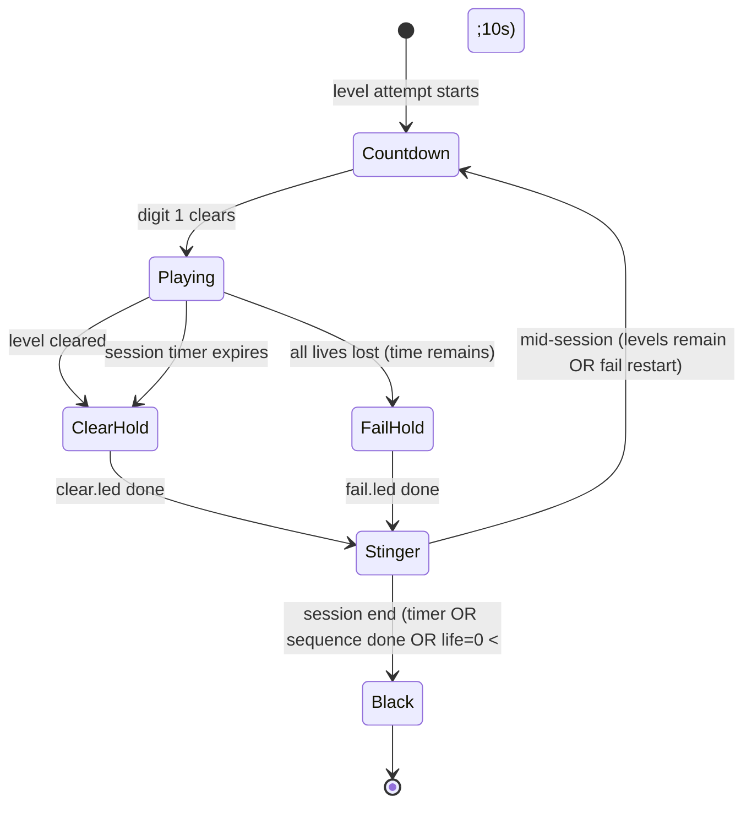

# LED Grid — effects implementation plan

Implementation plan for audio, countdown, level transitions, and LED floor
effects per [EFFECTS_SPEC.md](./EFFECTS_SPEC.md) and
[GLOBAL_RULES.md](../../docs/game-effects/GLOBAL_RULES.md).

**Status:** plan only (no runtime code in this commit).  
**Target repo:** `led-grid/`  
**Primary integration point:** `api/game_manager.py` session loop + marathon wiring.

---

## 1. Audit — current state vs spec

### 1.1 What exists today

| Area | Current behavior | Spec requirement | Gap |
|------|------------------|------------------|-----|
| **Session loop** | Marathon via `_build_level_sequence()` → `_run_level_attempt()` → `Play.running()` | Same core path, plus effect phases between attempts | No effect phases |
| **Level load** | `_load_level_file()` picks first `play_order=False` board; `prepare_level_for_platform()` scales to 16×26 | Effect `.led` mini-levels use same load + play pipeline | No `games/source/effects/` tree; no effect runner |
| **Countdown** | Frontend `CountdownScreen` runs **once** before `/start-game` (3-2-1-**GO**, 1 s/step, Web Audio beeps) | Floor countdown before **every** level; green 3-2-1 only on floor; tick SFX; ~0.8 s/digit | Backend never runs countdown; frontend timing/colors diverge; GO on floor forbidden |
| **Level clear** | `_level_cleared` flag → next level immediately | All blue ~2–3 s → stinger → countdown → next level | No blue hold, stinger, or inter-level countdown |
| **Level fail** | `life<=0` with >10 s session left sets `_restart_level`, refills HP, replays with no pause | All red ~2–3 s → stinger → countdown → same level | No fail screen, stinger, or countdown |
| **Timer expire** | Frame callback sets `_session_over`, `result=2`; session loop ends; `_hw_blank_floor()` | Blue clear hold → stinger → black; **no countdown** | Skips blue hold + stinger (jumps straight to blank) |
| **BGM** | `pygame` mocked in `game_manager.py` imports; no mixer calls | BGM only during active gameplay | Not wired |
| **Score SFX** | Frontend synth beeps on score/life change | Shared positive/negative MP3 (cross-game) | Backend + floor path silent; frontend uses placeholders |
| **Input gating** | `accepting_input` toggled around gameplay attempts | Input off during all effect/transition phases | Partially OK if effects reuse `begin_level_transition()` |
| **LED output** | Gameplay frames via priority classifier + `_hw_draw_floor()` | Effect frames must use same HW/sim publish path | Infrastructure reusable; effect frames never emitted |
| **State API** | `current_state` exposes score, life, `led_display`, `game_over`, etc. | UI/floor sync needs explicit phase | No `session_phase` / countdown digit fields |
| **Tests** | Strong coverage for scaling, catalog, gameplay scoring | None for effects/session transitions | New test module required |

### 1.2 Locked decisions (non-negotiable)

1. **Effect visuals = standalone `.led` mini-levels** under `games/source/effects/`, rendered with the same `Play.running()` path as gameplay levels (not hard-coded RGB fills in Python).
2. **Timer expire = session end:** `clear.led` → stinger → all black; **no countdown**.
3. **Non-blocking audio;** BGM **only** during active gameplay (`Play.running()` on a gameplay level).
4. **Countdown before every level start** (first level, after clear, after fail restart). Not after session end.

### 1.3 Reference assets

Capture timing reference: `~/Downloads/Floor is lava/`

| File | Use |
|------|-----|
| `game_start_countdown_visual.mp4` | Digit layout + ~0.8 s pacing |
| `level_clear_and_game_end_visual.mp4` | Blue full-floor hold |
| `all_lives_lost_level_failed_visual.mp4` | Red full-floor hold |
| `NSynk_-_bye-bye-bye_(mp3.pm).mp3.mpeg` | BGM |
| `positive_score_sound.mp3.mpeg` | Score gain SFX |
| `negative_score_sound.mp3.mpeg` | Penalty SFX |

Ship copies into `games/audio/effects/` (or `games/setting/` per existing convention) with stable filenames; do not read from `~/Downloads/` at runtime.

### 1.4 Spec doc note

`docs/EFFECTS_SPEC.md` § “Timer expire” is immediately followed by red fail bullets without a `## Level fail` heading. Implementation follows GLOBAL_RULES + locked decisions: **blue** on timer expire; **red** on all-lives-lost restart path.

---

## 2. Architecture

### 2.1 High-level session state machine



**Mid-session path:** `ClearHold → Stinger → Countdown → Playing` (next level).  
**Fail restart path:** `FailHold → Stinger → Countdown → Playing` (same level).  
**Session end path:** `ClearHold → Stinger → Black` (no countdown).

### 2.2 Effect `.led` inventory

Create `games/source/effects/` (not part of marathon tier lists):

| File | Purpose | Authored size | `board_time` target |
|------|---------|---------------|---------------------|
| `countdown.led` | Green centered 3, 2, 1 sequence | **16×26** | ~2.4 s (3×0.8 s) + trailing black |
| `clear.led` | Solid blue all cells | **16×26** | 2.5 s (tunable 2–3 s) |
| `fail.led` | Solid red all cells | **16×26** | 2.5 s |

Each archive contains **one** main board (`play_order=False`). Use `floor_light` groups only (no wall/screen). Colors:

- Countdown digits: green `(0, 254, 0)` middle ring per existing group color convention.
- Clear: blue `(0, 0, 254)`.
- Fail: red `(254, 0, 0)`.

Author with `zone_row_from=0, zone_row_to=16, zone_col_from=0, zone_col_to=26`, `scale=none`, full-matrix `activity_area`.

### 2.3 Platform scaling decision

**Decision: author effect `.led` files at native 16×26; do not rely on upscaling from legacy sizes.**

| Option | Pros | Cons |
|--------|------|------|
| **A. Native 16×26 (chosen)** | Pixel-accurate countdown glyphs; identity through `prepare_level_for_platform()`; matches onsite shelve defaults (`value_high=16`, `value_width=26`); no rounding drift on centered shapes | Must author/export at full size |
| B. Smaller authored + scale | Reuses level-editor habits (12×24 etc.) | `scale_cells` expansion blurs digit edges; centering math shifts with `ROUND_HALF_UP`; unnecessary for only three static effect files |

**Runtime rule:** still call `prepare_level_for_platform()` for effects (same as gameplay) so one code path handles future venue retargets. At 16×26 target, prepared geometry must be **bit-identical** to authored (assert in tests).

Solid fill patterns (clear/fail) *could* be generated in code, but locked decision #1 forbids that for shipping behavior.

### 2.4 Effect playback module

Add `api/effects_runner.py` (name flexible) with:

```python
def run_effect_led(
    path: Path,
    *,
    led_table,
    settings,
    play: Play,
    publish_frame,      # callable(led_display_2d) → HW + game.update_state
    stop_flag,          # threading.Event or lambda: not game.running
) -> None:
    """Load one effect .led, run Play.running() with a no-score callback."""
```

**Effect frame callback (contrasts with gameplay callback):**

- No scoring, life checks, or level-progress logic.
- `accepting_input = False` for entire effect.
- Stop when `total_pass >= board_time_sec` (from loaded groups) **or** `stop_flag`.
- Publish flat `led_display` from active `floor_light` groups (reuse winner map or direct group colors — effects have no overlaps).
- Do **not** advance session timer semantics; wall-clock session timer keeps running but gameplay BGM must not start.

Wire `_run_effect_led()` from the session loop in `GameManager.start_game()` `_run_game()` — **outside** the gameplay `_frame_callback`, reusing `_run_level_attempt()` load/prepare helpers where possible.

### 2.5 Session loop insertion points

Modify the outer loop in `game_manager.py` (~L1856+) as follows:

```
for lvl_path in level_sequence:
    while restart_loop:
        run_effect(countdown.led)          # NEW — every attempt
        audio.start_bgm()                  # NEW — after countdown
        _run_level_attempt(gameplay)       # existing
        audio.stop_bgm()                   # NEW — before any effect

        if session_over: break

        if restart_level:                  # all lives lost, time remains
            run_effect(fail.led)           # NEW
            run_stinger()                  # NEW
            run_effect(countdown.led)      # NEW
            refill_life; continue

        if level_cleared:
            run_effect(clear.led)          # NEW
            run_stinger()                  # NEW
            if more_levels and time_left:
                run_effect(countdown.led)  # NEW — next level (or fold into next loop iter)
            break

    if session_over from timeout:
        run_effect(clear.led)              # NEW — timer expire
        run_stinger()                      # NEW
        _hw_blank_floor()                  # existing — no countdown
        break
```

**First level of session:** remove dependency on frontend-only pre-start countdown for floor sync; backend countdown at loop entry is authoritative. Frontend may keep a cosmetic overlay but must subscribe to `session_phase` for alignment.

**Life=0 with ≤10 s left:** treat as session end (existing `result=0`); optionally `fail.led` → stinger → black (spec emphasizes fail→countdown→restart only when time remains — match current >10 s gate).

### 2.6 LED / HW publish path

Reuse existing pipeline:

1. Effect callback builds `led_display` row-major flat list (same as gameplay).
2. `game.update_state(led_display=..., session_phase=...)`.
3. `_hw_draw_floor()` when `USE_SERIAL_HD=1`.
4. `ws_bridge` already maps flat display → simulator grid.

Add `_publish_effect_frame()` helper to avoid duplicating HW throttle logic from `_frame_callback`.

### 2.7 API / frontend sync fields

Extend `GameInstance.current_state`:

| Field | Values | Purpose |
|-------|--------|---------|
| `session_phase` | `countdown`, `playing`, `clear`, `fail`, `stinger`, `ended` | UI overlay + QA |
| `countdown_digit` | `3`, `2`, `1`, `null` | Optional UI mirror (no floor GO) |
| `effect_name` | `countdown`, `clear`, `fail`, `null` | Debugging |

Frontend follow-ups (separate task): drive overlay from WebSocket state; align GO screen timing with backend `session_phase=playing` (~0.6 s after digit 1 clears, not before).

---

## 3. Audio architecture

### 3.1 Problem

`game_manager.py` injects `MagicMock` for `pygame` before imports to keep headless CI working. Production kiosk needs real audio.

### 3.2 Approach

Add `api/session_audio.py`:

| Method | Behavior |
|--------|----------|
| `init()` | Lazy `pygame.mixer.init()` once; no-op when `DISABLE_AUDIO=1` |
| `play_bgm(path, loops=-1)` | `mixer.music`; idempotent stop before start |
| `stop_bgm()` | Called before countdown, clear, fail, stinger, session end |
| `play_sfx(path)` | `mixer.Sound.play()` on a free channel — **non-blocking** |
| `play_stinger(path)` | Short one-shot; may use Sound or music channel but must not loop as BGM |
| `play_countdown_tick()` | Tick/noise per digit; reuse stock tick or slice of countdown asset |

**Policy enforcement:**

| Phase | BGM | SFX |
|-------|-----|-----|
| Countdown | off | tick per digit |
| Gameplay | on (`bye_bye_bye.mp3`) | score +/− |
| Clear / fail hold | off | optional none |
| Stinger | off | stinger clip (~2–3 s) |
| Session end | off | stinger then silence |

Use a dedicated thread or `Sound` channels only — never `play_sync()` / blocking `music` wait in the game thread.

### 3.3 Mock strategy for tests

- `DISABLE_AUDIO=1` default in pytest (via `conftest.py`).
- Integration tests assert `SessionAudio` call sequence via injected fake backend.
- Do **not** remove pygame mocks from import shim until `session_audio` imports mixer lazily **after** shim (or move shim below audio init).

### 3.4 Asset layout

```
games/audio/effects/
  bgm_bye_bye_bye.mp3
  sfx_positive.mp3
  sfx_negative.mp3
  sfx_countdown_tick.mp3      # stock OK
  sfx_level_transition.mp3    # stinger, stock OK until final asset
```

Copy from reference Downloads; normalize extensions to `.mp3`.

Hook score SFX in `GameInstance.try_score_cell()` after score mutations (backend authoritative — frontend synth becomes optional).

---

## 4. Authoring effect `.led` files

### 4.1 Tooling

Use the legacy level editor (or export script) to produce ZIP+shelve archives matching existing gameplay format. Validate with:

```bash
python scripts/validate_level_catalog.py --path games/source/effects --strict
```

Extend validator to accept an `effects/` root (currently only scans `games/source` tiers).

### 4.2 Countdown glyph layout

Target bounding box on 16×26 (centered):

- Vertical center ≈ rows 4–11 (8 px tall digits).
- Horizontal center ≈ cols 9–16 (8 px wide digits).
- Sequence timing via group `start_time_sec` / `end_time_sec`:

| Group | start | end | content |
|-------|-------|-----|---------|
| digit_3 | 0.0 | 0.8 | all cells of glyph 3 |
| digit_2 | 0.8 | 1.6 | glyph 2 |
| digit_1 | 1.6 | 2.4 | glyph 1 |
| (implicit) | 2.4+ | — | black (no active groups) |

Reference: `~/Downloads/Floor is lava/game_start_countdown_visual.mp4` + diagram `docs/assets/grid-effects-flows.png`.

### 4.3 Clear / fail

Single `floor_light` group, `start_member` = all 416 cells, `start_time_sec=0`, `end_time_sec=2.5`, solid color. No movement (`speed=0`).

---

## 5. Implementation tasks

Ordered for parallel work where noted.

### Phase A — Assets & data (can start immediately)

| ID | Task | Owner hint |
|----|------|------------|
| A1 | Create `games/source/effects/` with `countdown.led`, `clear.led`, `fail.led` at 16×26 | Content |
| A2 | Copy/normalize audio into `games/audio/effects/` | Content |
| A3 | Extend `validate_level_catalog.py` for effects directory | Backend |
| A4 | Add catalog snapshot test: 3 archives, identity scale at 16×26 | Backend |

### Phase B — Runtime core

| ID | Task | Depends |
|----|------|---------|
| B1 | `api/effects_runner.py` — load, prepare, `Play.running()` with effect callback | A1 |
| B2 | `api/session_audio.py` — non-blocking mixer wrapper + env guard | A2 |
| B3 | Refactor `_hw_draw_floor` publish into shared helper | — |
| B4 | Insert state machine into session loop (`game_manager.py`) | B1, B2, B3 |
| B5 | Wire score SFX in `try_score_cell()` | B2 |
| B6 | Timer expire: clear → stinger → black (no countdown) | B4 |
| B7 | Fail path: fail → stinger → countdown → restart | B4 |
| B8 | Clear path: clear → stinger → countdown → next level | B4 |
| B9 | Add `session_phase` / `countdown_digit` to `update_state()` | B4 |

### Phase C — UI & ops

| ID | Task | Depends |
|----|------|---------|
| C1 | Frontend: subscribe to `session_phase`; defer GO until `playing` | B9 |
| C2 | Remove or demote standalone pre-start countdown as sole source of truth | C1 |
| C3 | Document operator timing tuning constants (env or settings JSON) | B4 |
| C4 | Hardware validation checklist entry in `HARDWARE_VALIDATION.md` | B4 |

### Phase D — Hardening

| ID | Task |
|----|------|
| D1 | Ensure `clear_all()` / `stop_game()` stop audio + blank floor |
| D2 | Zombie thread audit: effect phases honor `game.running=False` |
| D3 | Group mode marathon: same effect paths as 1P |

---

## 6. Test plan

### 6.1 Unit tests (`tests/test_effects_runner.py`)

- Load each effect archive via production loaders; assert `row×col == 16×26` after prepare.
- Identity scaling: prepared cell set digest matches raw at 16×26 target.
- Countdown board has exactly three timed green digit groups in order.
- Clear/fail: one group covers all 416 cells with expected color.

### 6.2 Session transition tests (`tests/test_session_effects.py`)

Use injected fake audio + stub `Play.running()` that exits immediately.

| Case | Assert |
|------|--------|
| First level start | `countdown` → `playing`; BGM start exactly once after countdown |
| Level clear, more time + levels | `clear` → stinger → `countdown` → next gameplay load |
| All lives lost, time > 10 s | `fail` → stinger → `countdown` → same level path reloaded |
| Session timer expires mid-level | `clear` → stinger → `ended`; **no** countdown call |
| Sequence exhausted | final clear optional → stinger → black |
| `stop_game()` during countdown | audio stopped, floor blank |

### 6.3 Integration / HW smoke

- `USE_SERIAL_HD=0`: simulator shows digit sequence centered on 16×26 canvas.
- Compare key frames to reference PNG captures (manual or pixel diff threshold).
- `scripts/hw_mode_smoke_test.py` extension: one session cycle through countdown → short gameplay → clear.

### 6.4 Regression guards

- Existing `test_game_manager_level_scaling.py` and marathon tests unchanged.
- Gameplay scoring tests must pass with audio fake (no mixer init in CI).

---

## 7. Risks & mitigations

| Risk | Mitigation |
|------|------------|
| pygame mock blocks real audio | Lazy-init `session_audio` outside mocked import path; env flag |
| Double countdown (UI + backend) | Backend authoritative; UI follows `session_phase` |
| Effect `.led` accidentally in marathon tiers | Keep under `source/effects/`; exclude from `_TIERS_*` glob |
| Session timer elapses during stinger | Stinger is short; accept wall-clock drift; do not start next countdown if expired |
| Digit mis-center on non-16×26 venue | Effects authored at native size; document that retargeting requires re-export |
| HW draw rate during static holds | Static frames still throttle at `_HW_DRAW_INTERVAL`; OK for 2–3 s |

---

## 8. Acceptance criteria

1. Every gameplay level attempt is preceded by floor 3-2-1 green countdown (~0.8 s/digit, no floor GO).
2. Level clear shows full-floor blue ~2–3 s, stinger, then countdown before next level.
3. All lives lost (with session time remaining) shows full-floor red, stinger, countdown, same level restart with refilled HP.
4. Session timer expire shows full-floor blue, stinger, then all LEDs off — **no** countdown.
5. BGM plays only during active gameplay; off during countdown, transitions, clear, fail, and session end.
6. Score SFX fire on backend score changes without blocking the game thread.
7. Effect visuals loaded from `games/source/effects/*.led` via `Play.running()`, not hard-coded fills.
8. All new tests in §6 pass in CI with `DISABLE_AUDIO=1`.

---

## 9. References

- [EFFECTS_SPEC.md](./EFFECTS_SPEC.md)
- [GLOBAL_RULES.md](../../docs/game-effects/GLOBAL_RULES.md)
- [LEVELS.md](./LEVELS.md) — scaling semantics
- [grid-effects-flows.png](./assets/grid-effects-flows.png)
- `api/game_manager.py` — session loop, `_run_level_attempt`, `_frame_callback`
- `api/level_scaler.py` — `prepare_level_for_platform`
- `games/game_play/Play.py` — `running()`, `update()`
- `games/game_play/game_music.py` — legacy audio stage names (reference only)
- `CLIMB_MIGRATION_PLAYBOOK.md` §10 — `play_order` shelf semantics
