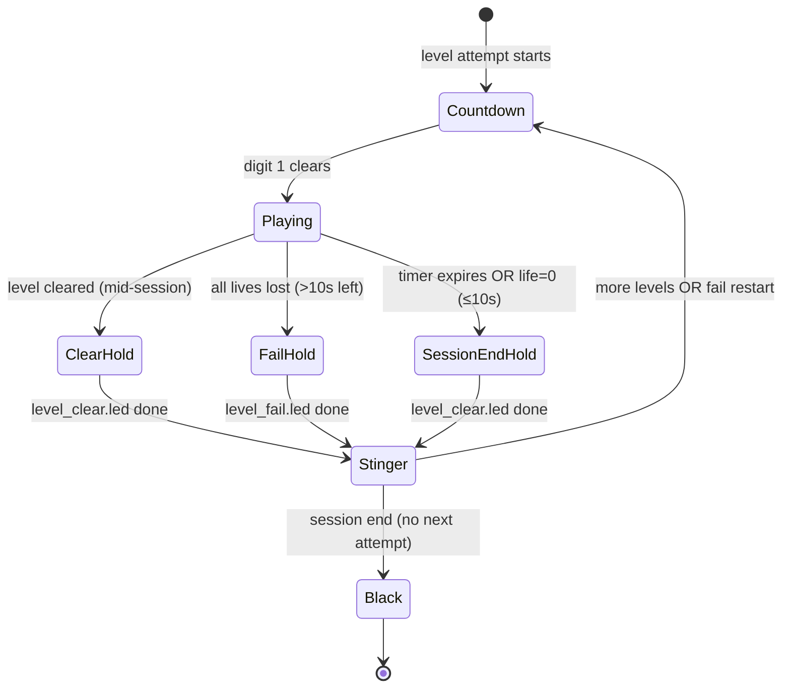

# LED Grid — effects implementation plan

Implementation plan for audio, countdown, level transitions, and LED floor
effects per [EFFECTS_SPEC.md](./EFFECTS_SPEC.md),
[GLOBAL_RULES.md](../../docs/game-effects/GLOBAL_RULES.md), and
[LOCKED_DECISIONS.md](../../docs/game-effects/LOCKED_DECISIONS.md).

**Status:** Aligned with locked product decisions — **ready for implementation**.  
**Target repo:** `led-grid/`  
**Primary integration point:** `api/game_manager.py` session loop + marathon wiring.

---

## Plan review (2026-08-07)

**Verdict:** **Ready** for parallel implementation after the revisions below (no blocking spec/code conflicts remain).

| Gate | Status |
|------|--------|
| Aligns with GLOBAL_RULES + EFFECTS_SPEC + diagram | **Pass** |
| Code audit vs `api/game_manager.py` (~L1840–1964) | **Pass** (gaps documented) |
| `.led` via same load/play path + native 16×26 | **Pass** |
| Session-end paths (timeout, life≤10s, sequence done) | **Fail → fixed** in §2.5 (`_finish_session()`) |
| Countdown single insertion point | **Fail → fixed** in §2.5 (top of restart loop only) |
| Non-blocking audio / BGM stop semantics | **Fail → fixed** in §3.2 |
| Frontend double-countdown on level 1 | **Locked** — both UI + floor countdown run (~sync) |

### Top findings

| # | Severity | Finding | Plan change |
|---|----------|---------|-------------|
| 1 | **Blocker (fixed)** | Marathon loop ends with immediate `_hw_blank_floor()` (~L1963) — no blue hold on **timer expire**, **life≤10s**, or **pre-loop timeout break** (~L1860–1863). | Added `_finish_session()`; all terminal paths call it before black. |
| 2 | **Blocker (fixed)** | Pseudocode ran `countdown.led` in both the restart-loop top **and** the clear/fail branches — risk of double countdown. | **Single** countdown at top of inner `while True`; clear/fail run hold + stinger only. |
| 3 | **Blocker (fixed)** | Fail-restart path refills HP (`refill_life_for_restart`, ~L1920–1924) **before** any effect phase would run. | Order locked: `level_fail.led` → stinger → `continue` → countdown (loop top) → refill HP → replay. |
| 4 | **High (fixed)** | Plan suggested `level_fail.led` for life=0 with ≤10s session time left. GLOBAL_RULES session/game over uses **level_clear** hold (same as timer expire), not red fail. | `_finish_session()` always plays `level_clear.led`; red fail only on >10s restart path. |
| 5 | **High (fixed)** | `stop_bgm()` must not call broad mixer stop that cuts stinger SFX channels (Hoops/Climb lesson). | §3.2: `mixer.music.stop()` only for BGM; stingers on dedicated `Sound` channels. |
| 6 | **High (fixed)** | Hold timing: separate `await_hold(2.5)` **plus** `.led` `end_time_sec` risks double hold / drift. | `.led` timeline is the single hold authority; stinger fires once at phase entry (concurrent, non-blocking). |
| 7 | **Medium (noted)** | `EFFECTS_SPEC.md` L81–96 — level-fail copy sits under **Timer expire**; stray red line at L89. | Task D4; implementation follows diagram + GLOBAL_RULES. |
| 8 | **Medium (locked)** | Pre-session `CountdownScreen` (3-2-1-**GO**, 1 s/step) must stay in sync with backend floor countdown. | Both UI and floor countdown run; backend `.led` authoritative for floor; UI mirrors `phase` + `countdown_digit`. |
| 9 | **Low (verified)** | `_run_level_attempt()` + `begin_level_transition` / `finish_level_transition` (~L554–599, L1123–1191), `prepare_level_for_platform()` (~L239+ in `level_scaler.py`), 16×26 defaults, diagram green 3-2-1 (no floor GO) — all match repo. | No change. |

### Locked decisions applied

All product decisions are locked in [LOCKED_DECISIONS.md](../../docs/game-effects/LOCKED_DECISIONS.md). Grid-specific notes:

| # | Locked decision | Grid application |
|---|-----------------|------------------|
| 1 | Effects directory | `games/source/effects/` |
| 2 | Effect files (exactly three) | `countdown.led`, `level_clear.led`, `level_fail.led` |
| 4 | UI + floor countdown | Both run; keep approximately in sync (floor from backend `.led`; UI countdown stays) |
| 5 | Transition stinger | One shared `games/audio/transition_stinger.mp3` for clear **and** fail |
| 6 | Audio helper | `api/audio_manager.py` with class `AudioManager` — non-blocking |
| 7 | Phase fields | `/game-state` exposes `phase` + `accepting_input` (no RFID changes) |
| 8–9 | Session end paths | Life=0 with ≤10 s left **or** last level cleared → `level_clear.led` → stinger → black; no countdown |
| 10 | Score SFX | Backend authoritative; mute frontend synth when backend audio active |
| 12 | `.led` authoring | Study existing levels; bootstrap effect `.led`; test in sim |

Additional Grid locks (from spec review):

| # | Decision |
|---|----------|
| G1 | **Effect visuals = standalone `.led` mini-levels**, loaded via `_load_level_file()` → `_prepare_level_attempt()` → `Play.running()` (not hard-coded RGB fills). |
| G2 | **Native 16×26 effect authoring** — archives authored at full matrix size; `prepare_level_for_platform()` still called for one code path / future retargets. |
| G3 | Floor countdown shows green **3-2-1 only** (no GO glyph on floor; UI may show GO when `phase=playing`). |

---

## 1. Audit — current state vs spec

### 1.1 What exists today

| Area | Current behavior | Spec requirement | Gap |
|------|------------------|------------------|-----|
| **Session loop** | Marathon via `_build_level_sequence()` → `_run_level_attempt()` → `Play.running()` (~L1856–1933) | Same core path, plus effect phases between attempts | No effect phases |
| **Level load** | `_load_level_file()` picks first `play_order=False` board; `prepare_level_for_platform()` scales to 16×26 | Effect `.led` mini-levels use same load + play pipeline | No `games/source/effects/` tree; no effect runner |
| **Countdown** | Frontend `CountdownScreen` runs **once** before `/start-game` (3-2-1-**GO**, 1 s/step, Web Audio beeps) | Floor countdown before **every** level; green 3-2-1 only on floor; tick SFX; ~0.8 s/digit | Backend never runs countdown; frontend timing/colors diverge; GO on floor forbidden |
| **Level clear** | `_level_cleared` flag → next level immediately | All blue ~2–3 s → stinger → countdown → next level | No blue hold, stinger, or inter-level countdown |
| **Level fail** | `life<=0` with >10 s session left sets `_restart_level`, refills HP, replays with no pause (~L1656–1662, L1920–1924) | All red ~2–3 s → stinger → countdown → same level | No fail screen, stinger, or countdown; refill runs too early |
| **Timer expire** | Frame callback sets `_session_over`, `result=2` (~L1666–1668); loop ends; `_hw_blank_floor()` (~L1963) | Blue clear hold → stinger → black; **no countdown** | Skips blue hold + stinger |
| **BGM** | `pygame` mocked in `game_manager.py` imports (~L74–75); no mixer calls | BGM only during active gameplay | Not wired |
| **Score SFX** | Frontend synth beeps on score/life change | Shared positive/negative MP3 (cross-game) | Backend + floor path silent; frontend uses placeholders |
| **Input gating** | `accepting_input` toggled via `begin_level_transition()` / `finish_level_transition()` | Input off during all effect/transition phases | Reuse `transition_consumer` in effect runner |
| **LED output** | Gameplay frames via priority classifier + `_hw_draw_floor()` | Effect frames must use same HW/sim publish path | Infrastructure reusable; effect frames never emitted |
| **State API** | `current_state` exposes score, life, `led_display`, `game_over`, etc. | UI/floor sync needs explicit phase | No `phase` / countdown digit fields |
| **Tests** | Strong coverage for scaling, catalog, gameplay scoring | None for effects/session transitions | New test module required |

### 1.2 Reference assets

Capture timing reference: `~/Downloads/Floor is lava/`

| File | Use |
|------|-----|
| `game_start_countdown_visual.mp4` | Digit layout + ~0.8 s pacing |
| `level_clear_and_game_end_visual.mp4` | Blue full-floor hold |
| `all_lives_lost_level_failed_visual.mp4` | Red full-floor hold |
| `NSynk_-_bye-bye-bye_(mp3.pm).mp3.mpeg` | BGM |
| `positive_score_sound.mp3.mpeg` | Score gain SFX |
| `negative_score_sound.mp3.mpeg` | Penalty SFX |

Ship copies into `games/audio/effects/` with stable filenames; do not read from `~/Downloads/` at runtime.

### 1.3 Spec doc note

`docs/EFFECTS_SPEC.md` § “Timer expire” (L81–96) is immediately followed by red fail bullets without a `## Level fail` heading; L89 incorrectly says red under timer expire. Implementation follows GLOBAL_RULES + diagram: **blue** on timer expire and session/game over; **red** on all-lives-lost restart path (>10 s remaining).

---

## 2. Architecture

### 2.1 High-level session state machine



**Mid-session clear:** `ClearHold → Stinger →` (next `lvl_path`) `Countdown → Playing`.  
**Fail restart:** `FailHold → Stinger → Countdown → Playing` (same level, HP refilled after countdown).  
**Session end** (timer, life≤10s, sequence exhausted, stop): `level_clear.led → Stinger → Black` — **no countdown**.

**Locked session flow** (from [LOCKED_DECISIONS.md](../../docs/game-effects/LOCKED_DECISIONS.md)):

```
Every level start:
  play(countdown.led) + UI countdown (~sync) → play(gameplay) + BGM

Lives = 0 and >10 s left:
  stop BGM → play(level_fail.led) + stinger → play(countdown.led) → restart same level

Lives = 0 and ≤10 s left:
  stop BGM → play(level_clear.led) + stinger → black → session end

Level cleared (more levels remain):
  stop BGM → play(level_clear.led) + stinger → play(countdown.led) → next level

Timer expire OR last level cleared:
  stop BGM → play(level_clear.led) + stinger → black → session end
```

### 2.2 Effect `.led` inventory

Create `games/source/effects/` (exclude from `_TIERS_*` marathon globs):

| File | Purpose | Authored size | `board_time` target |
|------|---------|---------------|---------------------|
| `countdown.led` | Green centered 3, 2, 1 sequence | **16×26** | ~2.4 s (3×0.8 s) + trailing black |
| `level_clear.led` | Solid blue all cells | **16×26** | 2.5 s (tunable 2–3 s) |
| `level_fail.led` | Solid red all cells | **16×26** | 2.5 s |

Each archive contains **one** main board (`play_order=False`). Use `floor_light` groups only (no wall/screen). Colors:

- Countdown digits: green `(0, 254, 0)`.
- Clear: blue `(0, 0, 254)`.
- Fail: red `(254, 0, 0)`.

Author with `zone_row_from=0, zone_row_to=16, zone_col_from=0, zone_col_to=26`, `scale=none`, full-matrix `activity_area`.

### 2.3 Platform scaling decision

**Decision: author effect `.led` files at native 16×26; do not rely on upscaling from legacy sizes.**

**Runtime rule:** still call `prepare_level_for_platform()` for effects (same as gameplay) so one code path handles future venue retargets. At 16×26 target, prepared geometry must be **bit-identical** to authored (assert in tests).

Solid fill patterns (`level_clear` / `level_fail`) *could* be generated in code, but locked decision G1 forbids that for shipping behavior.

### 2.4 Effect playback module

Add `api/effects_runner.py` (name flexible). Prefer wrapping **`_run_level_attempt()`** so `begin_level_transition()` / `finish_level_transition()` gating stays consistent:

```python
def run_effect_led(
    path: Path,
    *,
    game,
    led_table,
    settings,
    play: Play,
    publish_frame,      # callable(led_display) → HW + game.update_state
    stop_flag,          # lambda: not game.running
) -> None:
    """Load one effect .led, run Play.running() with a no-score callback."""
```

**Effect frame callback (contrasts with gameplay `_frame_callback`):**

- No scoring, life checks, or level-progress logic.
- `accepting_input = False` for entire effect.
- Stop when `total_pass >= board_time_sec` (from loaded groups) **or** `stop_flag` **or** `game._session_over`.
- Publish flat `led_display` from active `floor_light` groups (effects have no overlaps — direct group colors OK).
- Derive `countdown_digit` (`3`/`2`/`1`/`null`) from which green digit group is active at `total_pass`.
- Wall-clock session timer keeps running; effect time counts against the 5-min marathon (existing `session_elapsed` semantics).

Wire from `GameManager.start_game()` → `_run_game()` — **outside** the gameplay `_frame_callback`.

### 2.5 Session loop insertion points

Modify the session loop in `game_manager.py` (~L1840–1964). Add helpers:

```python
def _finish_session(game, audio):
    """Session end: level_clear hold → stinger → black. No countdown."""
    if game.running:
        run_effect_led(level_clear.led, phase="level_clear", ...)
        audio.play_stinger()          # fire-and-forget; concurrent with clear hold
    game.update_state(phase="session_end")
    _hw_blank_floor(game.led_table)
```

**Corrected marathon pseudocode:**

```
for lvl_path in level_sequence:
    if game._session_over or not game.running: break
    if session_elapsed > game.game_time_sec:
        game._session_over = True; game._end_reason = "timeout"; break

    while True:                                    # restart loop (same lvl_path)
        run_effect_led(countdown.led, ...)         # EVERY attempt — single insertion point
        audio.play_countdown_ticks()               # per digit, non-blocking
        if game._restart_level:                    # set by prior fail exit; consume before play
            game.refill_life_for_restart()
            game._restart_level = False
        audio.start_bgm()
        _run_level_attempt(gameplay lvl_path, ...) # existing path
        audio.stop_bgm()                           # mixer.music only

        if game._session_over: break

        if game._restart_level:                    # life=0, >10s session time left
            run_effect_led(level_fail.led, ...)
            audio.play_stinger()
            continue                                 # → countdown at loop top, then refill

        if game._level_cleared:
            game.levels_cleared += 1
            run_effect_led(level_clear.led, ...)
            audio.play_stinger()
            break                                    # next lvl_path → its own countdown

        break

    if game._session_over: break

# ALL terminal exits (timeout break, life≤10s, sequence done, stop_game):
_finish_session(game, audio)                       # replaces bare _hw_blank_floor at ~L1963
# then existing result / game_over state publish
```

**Path notes:**

| Exit | Effect sequence before black |
|------|------------------------------|
| Timer expire mid-level | `_finish_session()` → `level_clear` + stinger (no countdown) |
| Life=0 with ≤10 s left | `_finish_session()` → `level_clear` + stinger (not `level_fail`) |
| Pre-loop timeout (~L1860) | `_finish_session()` before result publish |
| Last level cleared | `level_clear` + stinger already ran in inner loop → `_finish_session()` only blanks (no second clear, no countdown) |
| Fail restart (>10 s) | `level_fail` + stinger → countdown → refill → replay; no `_finish_session()` |

**First level:** backend countdown at loop entry runs in parallel with UI countdown (~sync). Both are authoritative for their surfaces (see locked decision #4).

### 2.6 LED / HW publish path

Reuse existing pipeline:

1. Effect callback builds `led_display` row-major flat list (same as gameplay).
2. `game.update_state(led_display=..., phase=..., accepting_input=..., countdown_digit=...)`.
3. `_hw_draw_floor()` when `USE_SERIAL_HD=1`.
4. `ws_bridge` already maps flat display → simulator grid.

Add `_publish_effect_frame()` helper to avoid duplicating HW throttle logic from `_frame_callback` (~L1792–1805).

### 2.7 API / frontend sync fields

Extend `GameInstance.current_state`:

| Field | Values | Purpose |
|-------|--------|---------|
| `phase` | `countdown`, `playing`, `level_clear`, `level_fail`, `session_end` | UI overlay + QA (per LOCKED_DECISIONS) |
| `accepting_input` | `true` / `false` | Input gating during effect/transition phases |
| `countdown_digit` | `3`, `2`, `1`, `null` | UI mirror (no floor GO) |
| `effect_name` | `countdown`, `level_clear`, `level_fail`, `null` | Debugging |

Frontend follow-ups (Phase C): drive overlay from polled `/game-state` or WebSocket; keep UI countdown approximately in sync with floor `.led`; show UI **GO** only when `phase=playing` (after digit 1 clears on floor, ~0.6 s cosmetic delay OK).

---

## 3. Audio architecture

### 3.1 Problem

`game_manager.py` injects `MagicMock` for `pygame` before imports (~L74–75) to keep headless CI working. Production kiosk needs real audio.

### 3.2 Approach

Add `api/audio_manager.py` with class `AudioManager`:

| Method | Behavior |
|--------|----------|
| `init()` | Lazy `pygame.mixer.init()` once; no-op when `DISABLE_AUDIO=1` |
| `play_bgm(path, loops=-1)` | `mixer.music`; idempotent stop before start |
| `stop_bgm()` | **`mixer.music.stop()` only** — must not stop SFX/stinger channels |
| `play_sfx(path)` | `mixer.Sound.play()` on a free channel — **non-blocking** |
| `play_stinger()` | Short one-shot on SFX channel; fire-and-forget at hold phase entry; uses `games/audio/transition_stinger.mp3` |
| `play_countdown_tick()` | Tick/noise per digit boundary during countdown effect |

**Policy enforcement:**

| Phase | BGM | SFX |
|-------|-----|-----|
| Countdown | off | tick per digit |
| Gameplay | on (`bgm_bye_bye_bye.mp3`) | score +/− |
| Clear / fail hold | off | optional none |
| Stinger | off | stinger clip (~2–3 s, concurrent with hold) |
| Session end | off | stinger then silence |

Never block the game thread on mixer I/O.

### 3.3 Mock strategy for tests

- `DISABLE_AUDIO=1` default in pytest (via `conftest.py`).
- Integration tests assert `AudioManager` call sequence via injected fake backend.
- Lazy-init mixer inside `audio_manager` **after** import shim (do not remove shim until then).

### 3.4 Asset layout

```
games/audio/
  transition_stinger.mp3        # shared clear + fail stinger (MVP)
games/audio/effects/
  bgm_bye_bye_bye.mp3
  sfx_positive.mp3
  sfx_negative.mp3
  sfx_countdown_tick.mp3        # stock OK
```

Hook score SFX in `GameInstance.try_score_cell()` (~L1238+) after score/life mutations (backend authoritative).

---

## 4. Authoring effect `.led` files

### 4.1 Tooling

Use the legacy level editor (or export script) to produce ZIP+shelve archives matching existing gameplay format. Validate with:

```bash
python scripts/validate_level_catalog.py --path games/source/effects --strict
```

Extend validator to accept an `effects/` root (currently only scans `games/source` tiers).

### 4.2 Countdown glyph layout

Target bounding box on 16×26 (centered):

- Vertical center ≈ rows 4–11 (8 px tall digits).
- Horizontal center ≈ cols 9–16 (8 px wide digits).
- Sequence timing via group `start_time_sec` / `end_time_sec`:

| Group | start | end | content |
|-------|-------|-----|---------|
| digit_3 | 0.0 | 0.8 | all cells of glyph 3 |
| digit_2 | 0.8 | 1.6 | glyph 2 |
| digit_1 | 1.6 | 2.4 | glyph 1 |
| (implicit) | 2.4+ | — | black (no active groups) |

Reference: `~/Downloads/Floor is lava/game_start_countdown_visual.mp4` + [grid-effects-flows.png](./assets/grid-effects-flows.png).

### 4.3 Level clear / level fail

Single `floor_light` group, `start_member` = all 416 cells, `start_time_sec=0`, `end_time_sec=2.5`, solid color. No movement (`speed=0`).

---

## 5. Implementation tasks

### Phase A — Assets & data (can start immediately)

| ID | Task | Owner hint |
|----|------|------------|
| A1 | Create `games/source/effects/` with `countdown.led`, `level_clear.led`, `level_fail.led` at 16×26 | Content |
| A2 | Copy/normalize audio into `games/audio/` + `games/audio/effects/` (incl. shared `transition_stinger.mp3`) | Content |
| A3 | Extend `validate_level_catalog.py` for effects directory | Backend |
| A4 | Add catalog snapshot test: 3 archives, identity scale at 16×26 | Backend |

### Phase B — Runtime core

| ID | Task | Depends |
|----|------|---------|
| B1 | `api/effects_runner.py` — wrap `_run_level_attempt()` + effect callback | A1 |
| B2 | `api/audio_manager.py` — `AudioManager` non-blocking mixer wrapper + env guard | A2 |
| B3 | Refactor HW publish into `_publish_effect_frame()` shared helper | — |
| B4 | `_finish_session()` + state machine in session loop | B1, B2, B3 |
| B5 | Wire score SFX in `try_score_cell()` | B2 |
| B6 | Timer / life≤10s / pre-loop timeout → `_finish_session()` | B4 |
| B7 | Fail path: `level_fail` → stinger → continue → countdown → refill → replay | B4 |
| B8 | Clear path: `level_clear` → stinger → break (countdown on next loop iter) | B4 |
| B9 | Add `phase`, `accepting_input`, `countdown_digit` to `update_state()` | B4 |

### Phase C — UI & ops

| ID | Task | Depends |
|----|------|---------|
| C1 | Frontend: subscribe to `phase`; keep UI countdown ~sync with floor; defer GO until `playing` | B9 |
| C2 | Align pre-start UI countdown with backend floor countdown (both run) | C1 |
| C3 | Document operator timing tuning constants (env or settings JSON) | B4 |
| C4 | Hardware validation checklist entry in `HARDWARE_VALIDATION.md` | B4 |

### Phase D — Hardening

| ID | Task |
|----|------|
| D1 | Ensure `clear_all()` / `stop_game()` stop audio + blank floor |
| D2 | Zombie thread audit: effect phases honor `game.running=False` |
| D3 | Group mode marathon: same effect paths as 1P |
| D4 | Fix `EFFECTS_SPEC.md` timer/fail section headings (doc-only) |

---

## 6. Test plan

### 6.1 Unit tests (`tests/test_effects_runner.py`)

- Load each effect archive via production loaders; assert `row×col == 16×26` after prepare.
- Identity scaling: prepared cell set digest matches raw at 16×26 target.
- Countdown board has exactly three timed green digit groups in order.
- Clear/fail: one group covers all 416 cells with expected color (`level_clear` blue, `level_fail` red).

### 6.2 Session transition tests (`tests/test_session_effects.py`)

Use injected fake audio + stub `Play.running()` that exits immediately.

| Case | Assert |
|------|--------|
| First level start | `countdown` → `playing`; BGM start exactly once after countdown |
| Level clear, more time + levels | `level_clear` → stinger → `countdown` → next gameplay load |
| All lives lost, time > 10 s | `level_fail` → stinger → `countdown` → refill → same level reloaded |
| Session timer expires mid-level | `_finish_session`: `level_clear` → stinger → `session_end`; **no** countdown |
| Life=0 with ≤10 s left | `_finish_session`: `level_clear` (not `level_fail`) → stinger → black; **no** countdown |
| Sequence exhausted (last level clear) | `level_clear` → stinger in loop; `_finish_session` blanks only — **no** second clear, **no** countdown |
| Pre-loop timeout break | `_finish_session` before `game_over` publish |
| `stop_game()` during countdown | audio stopped, floor blank |

### 6.3 Integration / HW smoke

- `USE_SERIAL_HD=0`: simulator shows digit sequence centered on 16×26 canvas.
- Compare key frames to reference PNG captures (manual or pixel diff threshold).
- `scripts/hw_mode_smoke_test.py` extension: one session cycle through countdown → short gameplay → clear.

### 6.4 Regression guards

- Existing `test_game_manager_level_scaling.py` and marathon tests unchanged.
- Gameplay scoring tests must pass with audio fake (no mixer init in CI).

---

## 7. Risks & mitigations

| Risk | Mitigation |
|------|------------|
| pygame mock blocks real audio | Lazy-init `audio_manager` outside mocked import path; env flag |
| UI + floor countdown drift | Both run; UI mirrors `phase` + `countdown_digit`; backend `.led` drives floor |
| Effect `.led` accidentally in marathon tiers | Keep under `source/effects/`; exclude from `_TIERS_*` glob |
| Session timer elapses during stinger/countdown | Check `_session_over` / time before starting next countdown; route to `_finish_session()` |
| Digit mis-center on non-16×26 venue | Effects authored at native size; document that retargeting requires re-export |
| HW draw rate during static holds | Static frames still throttle at `_HW_DRAW_INTERVAL`; OK for 2–3 s |
| BGM stop kills stinger | `stop_bgm()` uses `mixer.music.stop()` only |

---

## 8. Acceptance criteria

1. Every gameplay level attempt is preceded by floor 3-2-1 green countdown (~0.8 s/digit, no floor GO).
2. Level clear shows full-floor blue ~2–3 s, stinger, then countdown before next level.
3. All lives lost (with session time remaining >10 s) shows full-floor red, stinger, countdown, same level restart with refilled HP.
4. Session timer expire shows full-floor blue, stinger, then all LEDs off — **no** countdown.
5. Life=0 with ≤10 s session time shows `level_clear` (blue) hold, stinger, then black — **no** `level_fail` red, **no** countdown.
6. Last level cleared shows `level_clear` hold, stinger, then black — **no** countdown.
7. BGM plays only during active gameplay; off during countdown, transitions, clear, fail, and session end.
8. Score SFX fire on backend score changes without blocking the game thread; frontend synth muted when backend audio active.
9. Effect visuals loaded from `games/source/effects/*.led` via `Play.running()`, not hard-coded fills.
10. All new tests in §6 pass in CI with `DISABLE_AUDIO=1`.

---

## 9. References

- [LOCKED_DECISIONS.md](../../docs/game-effects/LOCKED_DECISIONS.md)
- [EFFECTS_SPEC.md](./EFFECTS_SPEC.md)
- [GLOBAL_RULES.md](../../docs/game-effects/GLOBAL_RULES.md)
- [LEVELS.md](./LEVELS.md) — scaling semantics
- [grid-effects-flows.png](./assets/grid-effects-flows.png)
- `api/game_manager.py` — session loop (~L1840–1964), `_run_level_attempt`, `_frame_callback`
- `api/level_scaler.py` — `prepare_level_for_platform`
- `games/game_play/Play.py` — `running()`, `update()`
- `games/game_play/game_music.py` — legacy audio stage names (reference only)
- `CLIMB_MIGRATION_PLAYBOOK.md` §10 — `play_order` shelf semantics
