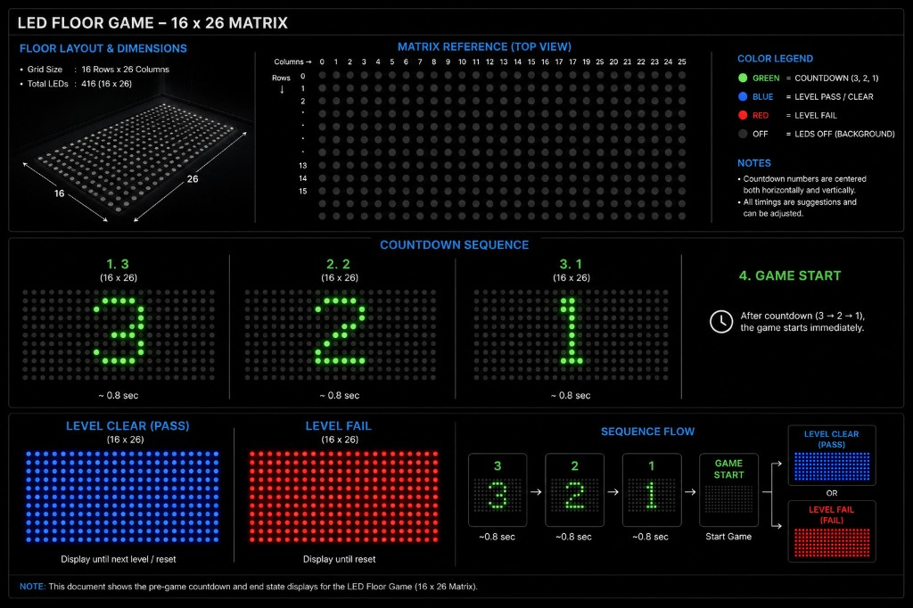

# LED Grid (Floor is Lava) — effects spec

Audio, countdown, and LED floor behavior for **LED Grid / Floor is Lava**.

Global rules: [activerse_final_changes/docs/game-effects/GLOBAL_RULES.md](../../docs/game-effects/GLOBAL_RULES.md)

Matrix reference: [GRID_MATRICES.md](../../docs/game-effects/GRID_MATRICES.md)

---

## Floor layout (16 × 26)

| Dimension | Value |
|-----------|--------|
| **Grid size** | **16 rows × 26 columns** |
| **Total LEDs** | **416** |
| **Indexing** | Row **0** = top, col **0** = left → row **15**, col **25** bottom-right |
| **Usable area** | **Full 16×26** — all cells |

### Color legend

| Color | Meaning |
|-------|---------|
| **Green** | Countdown digits (3, 2, 1) |
| **Blue** | Level clear / pass |
| **Red** | Level fail |
| **Off** | LEDs off (background) |

### Effects flow diagram

---

## Audio assets

| Asset | File / source |
|-------|---------------|
| **BGM** | *Bye Bye Bye* (NSync) — level play only |
| **Positive score SFX** | Shared positive MP3 (cross-game) |
| **Negative score SFX** | Shared negative MP3 (cross-game) |
| **Countdown** | Tick/noise during 3-2-1; **no BGM** |
| **Level transition** | Short stinger ~2–3 s (asset TBD / stock OK) |

---

## Countdown (every level start)

Runs before **every level** — first level of the session, after level clear,
and after level fail restart. **Not** repeated when the session has ended.

Tick/noise audio; no BGM. Each digit is **green**, **centered horizontally
and vertically** on the full 16×26 floor.

| Step | Duration | LED pattern |
|------|----------|-------------|
| **3** | ~0.8 s | Green **"3"** centered on floor |
| **2** | ~0.8 s | Green **"2"** centered on floor |
| **1** | ~0.8 s | Green **"1"** centered on floor |
| **Start** | — | Digit clears → level play begins (BGM on) |

> Grid floor countdown is **3-2-1** only (no **GO** glyph on the floor).
> The UI may still show **GO** on screen — keep UI and floor in sync on timing.

Timings are suggestions — tune to show pace.

---

## Level clear

**All 416 LEDs → solid blue.**

1. Hold clear pattern ~2–3 s with transition stinger (not BGM)
2. **Countdown** (3-2-1 sequence above)
3. **Next level** play begins

If more levels remain: clear → stinger → countdown → play.

If the timer expires on the **final level** and the session ends → all LEDs
**black / off** after the clear hold (**no** countdown).

---

## Level fail

**All 416 LEDs → solid red.**

Triggered when **all lives are lost**.

1. Hold fail pattern ~2–3 s with transition stinger (not BGM)
2. **Countdown** (3-2-1 sequence above)
3. **Same level** restart play begins

---

## Timer expire

Same LED treatment as **level clear** (full floor **blue**).

If more levels remain: clear hold → stinger → **countdown** → next level.

If session ends: all LEDs **black / off** after clear hold (**no** countdown).

---

## Reference media

Capture and timing reference: **`~/Downloads/Floor is lava/`**

Use for LED pattern design only — not frontend video playback.
